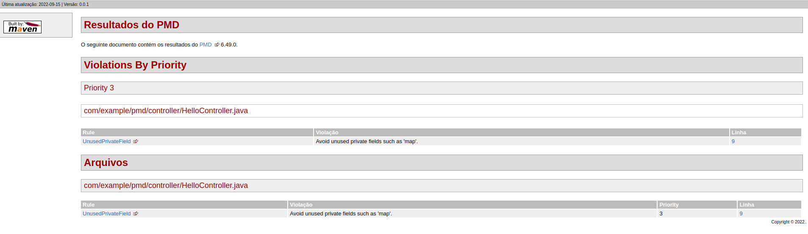

[](https://github.com/danielso2007/spring-boot-pmd/actions/workflows/maven.yml)

# Visão Geral

O PMD é um analisador de código fonte estático (Automated code review) de código aberto que relata os problemas encontrados no código do aplicativo. O PMD inclui conjuntos de regras integrados e oferece suporte à capacidade de escrever regras personalizadas. O PMD não relata erros de compilação, pois só pode processar arquivos de origem bem formados. Os problemas relatados pelo PMD são códigos bastante ineficientes ou maus hábitos de programação, que podem reduzir o desempenho e a manutenção do programa se eles se acumularem. Ele pode analisar arquivos escritos em Java , JavaScript , Apex e Visualforce, PLSQL , Apache Velocity , XML e XSL.

Simplificando, o PMD é um analisador de código-fonte para encontrar falhas comuns de programação, como variáveis não utilizadas, blocos catch vazios, criação desnecessária de objetos e assim por diante.

O PMD apresenta muitas verificações internas (no jargão do PMD, rules ), que são documentadas para cada idioma em nossas referências de regras. Também oferecemos suporte a uma API extensa para escrever suas próprias regras, que você pode fazer em Java ou como uma consulta XPath independente.

O PMD é mais útil quando integrado ao seu processo de compilação. Ele pode então ser usado como um portão de qualidade, para impor um padrão de codificação para sua base de código. Entre outras coisas, o PMD pode ser executado:

Como uma meta do Maven
Como uma tarefa Ant
Como uma tarefa Gradle
Da linha de comando

# Funcionamento

O PMD é capaz de detectar falhas ou possíveis falhas no código-fonte, como:

- Possíveis bugs - Esvaziar blocos **try/catch/finally/switch**.
- Código morto - Variáveis locais não utilizadas, parâmetros e métodos privados.
- Declarações **if/while** vazias.
- Expressões super complicadas - Instruções **if** desnecessárias, para loops que podem ser loops while.
- Código abaixo do ideal - Uso de **String/StringBuffer** desperdiçado.
- Classes com medições de alta complexidade ciclomática .
- Código duplicado - Código copiado/colado pode significar erros copiados/colados e diminui a capacidade de manutenção.

# Maven PMD Plugin

Você pode encontrar a versão mais recente do **maven-pmd-plugin** [aqui](https://mvnrepository.com/artifact/org.apache.maven.plugins/maven-pmd-plugin).

Para iniciar, defina o maven-pmd-plugin na tag reporting, para que `./mvnw pmd:check` gere o relatório PMD na pasta `/target/site`.

## Properties do Maven

```xml
<!-- PMD -->
<maven.pmd.plugin.version>3.19.0</maven.pmd.plugin.version>
<maven.jxr.plugin.version>3.3.0</maven.jxr.plugin.version>
```

## Tag Reporting

```xml
<build>
   …
   <pluginManagement>
      <plugins>
         <plugin>
            <!-- PMD source code analyzer -->
            <groupId>org.apache.maven.plugins</groupId>
            <artifactId>maven-pmd-plugin</artifactId>
            <version>${maven.pmd.plugin.version}</version>
         </plugin>
      </plugins>
   </pluginManagement>
</build>

<reporting>
   <plugins>
      <plugin>
         <!-- Usado no PMD source code analyzer -->
         <groupId>org.apache.maven.plugins</groupId>
         <artifactId>maven-jxr-plugin</artifactId>
         <version>${maven.jxr.plugin.version}</version>
      </plugin>
      <plugin>
         <!-- PMD source code analyzer -->
         <groupId>org.apache.maven.plugins</groupId>
         <artifactId>maven-pmd-plugin</artifactId>
         <version>${maven.pmd.plugin.version}</version>
         <configuration>
            <rulesets>
               <ruleset>/rulesets/java/braces.xml</ruleset>
               <ruleset>/rulesets/java/naming.xml</ruleset>
               <ruleset>/rulesets/java/codesize.xml</ruleset>
               <ruleset>/rulesets/java/comments.xml</ruleset>
               <ruleset>/rulesets/java/coupling.xml</ruleset>
               <ruleset>/rulesets/java/design.xml</ruleset>
               <ruleset>/rulesets/java/empty.xml</ruleset>
               <ruleset>/rulesets/java/finalizers.xml</ruleset>
               <ruleset>/rulesets/java/imports.xml</ruleset>
               <ruleset>/rulesets/java/javabeans.xml</ruleset>
               <ruleset>/rulesets/java/naming.xml</ruleset>
               <ruleset>/rulesets/java/optimizations.xml</ruleset>
               <ruleset>/rulesets/java/strictexception.xml</ruleset>
               <ruleset>/rulesets/java/strings.xml</ruleset>
               <ruleset>/rulesets/java/unusedcode.xml</ruleset>
            </rulesets>
         </configuration>
      </plugin>
   </plugins>
</reporting>
```

Observe como estamos adicionando conjuntos de regras na configuração aqui - esses são um caminho relativo para definir regras da biblioteca principal do PMD.

## Resultando no terminal

<p align="center">
  
</p>

## Site gerado no target da aplicação

<p align="center">
  
</p>

# Conjuntos de regras

O plug-in PMD usa cinco conjuntos de regras padrão:

- basic.xml
- vazio.xml
- imports.xml
- desnecessário.xml
- código não usado.xml

Você pode usar outros conjuntos de regras ou criar seus próprios conjuntos de regras e configurá-los no plugin:

```xml
<reporting>
   <plugins>
      <plugin>
         <!-- Usado no PMD source code analyzer -->
         <groupId>org.apache.maven.plugins</groupId>
         <artifactId>maven-jxr-plugin</artifactId>
         <version>${maven.jxr.plugin.version}</version>
      </plugin>
      <plugin>
         <!-- PMD source code analyzer -->
         <groupId>org.apache.maven.plugins</groupId>
         <artifactId>maven-pmd-plugin</artifactId>
         <version>${maven.pmd.plugin.version}</version>
         <configuration>
            <rulesets>
               <ruleset>/rulesets/java/braces.xml</ruleset>
               <ruleset>/rulesets/java/naming.xml</ruleset>
               <ruleset>/usr/pmd/rulesets/strings.xml</ruleset>
               <ruleset>http://localhost/design.xml</ruleset>
            </rulesets>
         </configuration>
      </plugin>
   </plugins>
</reporting>
```

Observe que estamos usando um endereço relativo, um endereço absoluto ou até mesmo uma URL - como o valor do 'ruleset' na configuração.

Uma estratégia limpa para customizar quais regras usar para um projeto é escrever um arquivo de ruleset customizado. Neste arquivo, podemos definir quais regras usar, adicionar regras personalizadas e personalizar quais regras incluir/excluir dos ruleset oficiais.

Para documentação da customização do ruleset, ver aqui.

# Verificando o código da aplicação

Configurando o <goal>check</goal>, a verificação de objetivo mencionada na seção de executions solicita que o plug-in seja executado na fase de verificação da compilação e força uma falha de compilação quando ocorre uma violação dos padrões de codificação.

```xml
<build>
   …
   <plugins>
      …
      <plugin>
         <!-- PMD source code analyzer -->
         <groupId>org.apache.maven.plugins</groupId>
         <artifactId>maven-pmd-plugin</artifactId>
         <version>${maven.pmd.plugin.version}</version>
         <configuration>
            <linkXRef>true</linkXRef>
            <sourceEncoding>${project.build.sourceEncoding}</sourceEncoding>
            <failOnViolation>true</failOnViolation>
            <printFailingErrors>true</printFailingErrors>
         </configuration>
         <executions>
            <execution>
               <goals>
                  <goal>check</goal>
               </goals>
            </execution>
         </executions>
      </plugin>
      …
   </plugins>
   …
</build>
```

Agora, se executarmos o comando `./mvnw clean install`, ele verificará os arquivos em busca de violações e a compilação falhará se alguma violação for encontrada.

Também podemos executar apenas o objetivo de verificação do plugin usando `./mvnw pmd:check`. A execução desta etapa também resultará em uma falha de compilação se houver algum erro de validação.

O comando `./mvnw clean verify` também pode ser executado para verificar violação.

## Resultado no terminal

<p align="center">
  
</p>

# Projeto de Exemplo

Para verificar a aplicação de exemplo, acesse o repositório [aqui](https://github.com/danielso2007/spring-boot-pmd). Caso queira rodar o projeto, execute `./mvnw spring-boot:run`.


